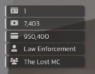

# SG Minihud

Mini player hud for id, money, job and gang

## Features

Realtime info with minimal screen realestate.
- Info Displayed:
  - Server ID
  - Cash (Flashes with money add/remove/set)
  - Bank (Flashes with money add/remove/set)
  - Job Name (Flashes with job change)
  - Gang Name (Flashes with gang change)

## Requirements

- [qb-core](https://github.com/qbcore-framework/qb-core)
- [ox_lib](https://github.com/overextended/ox_lib/releases)

## Installation

1. Download the latest version
2. Place `sg-minihud` in your `resources` or `standalone` folder (remove `-main` from folder if necessary).
3. Add `ensure sg-minihud` to your server.cfg (after all qb scripts), unless added in `standalone` folder.
4. Configure the keys in `config.lua`.
5. Open the styles.css and adjust the colors in `:root` as desired.
6. Restart your server.


## Usage

Minihud is off by default.
Players can toggle it on by pressing F9 (default).
Players can hold SHIFT and press F9 (default) to move the hud to the desired location. Press ESCAPE or the X on the hud to close.

All preferences are saved to KVP and loaded on player load.

### Exports

```lua
--@param boolean | true/false to show/hide the display
exports['sg-minihud']:ToggleHud(bool)
```
- Can be used to toggle the hud on and off if in the way of other UI's.
  - Will check for `display` before enabling/disabling as to not change the user settings.

 ```lua
exports['sg-minihud']:isHudActive()
```
- Returns the `display` variable to determine if hud is showing for the player.
  - Example: Added to  qb/ps-hud to determine if minihud is showing before updating the money
```lua
  RegisterNetEvent('hud:client:OnMoneyChange', function(type, amount, isMinus)
    local hudActive = exports['sg-minihud']:isHudActive()
    if not hudActive then
        cashAmount = PlayerData.money['cash']
        bankAmount = PlayerData.money['bank']
        SendNUIMessage({
            action = 'updatemoney',
            cash = cashAmount,
            bank = bankAmount,
            amount = amount,
            minus = isMinus,
            type = type
        })
    end
  end)
```

## Preview



https://medal.tv/games/gta-v/clips/26W3yD72INoANk/d1337FFbRHtY?invite=cr-MSw3TnAsNDI5MDA5Mzgs

## Credits

- Created by: [Nicky](https://forum.cfx.re/u/Sanriku)
- [SG Scripts Discord](https://discord.gg/uEDNgAwhey)
